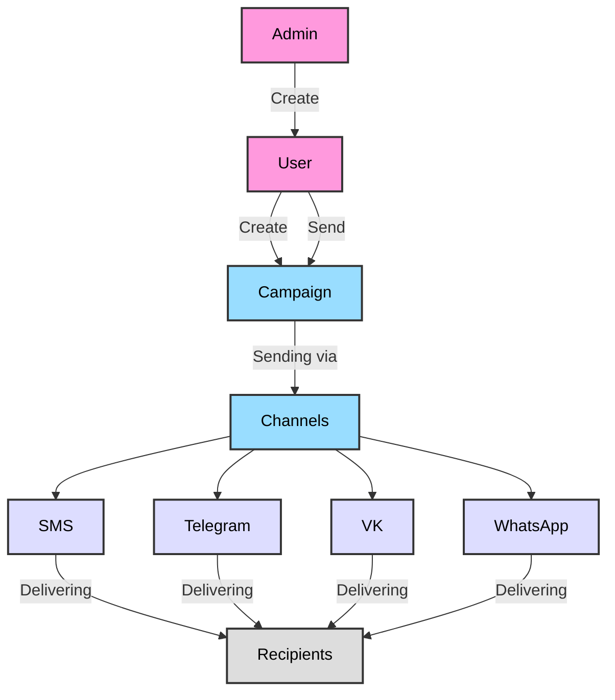

```mermaid
graph TD
    Admin["Admin"]
    User["User"]
    
    Campaign["Campaign"]
    
    Channels["Channels"]
    SMS["SMS"]
    Telegram["Telegram"]
    VK["VK"]
    WhatsApp["WhatsApp"]
    
    Recipients["Recipients"]
    
    Admin -->|"Create"| User
    User -->|"Create"| Campaign
    User -->|"Send"| Campaign
    
    Campaign -->|"Sending via"| Channels
    Channels --> SMS
    Channels --> Telegram
    Channels --> VK
    Channels --> WhatsApp
    
    SMS -->|"Delivering"| Recipients
    Telegram -->|"Delivering"| Recipients
    VK -->|"Delivering"| Recipients
    WhatsApp -->|"Delivering"| Recipients
    
    classDef actor fill:#f9d,stroke:#333,stroke-width:2px,color:black;
    classDef object fill:#9df,stroke:#333,stroke-width:2px,color:black;
    classDef channel fill:#ddf,stroke:#333,stroke-width:2px,color:black;
    classDef recipient fill:#ddd,stroke:#333,stroke-width:2px,color:black;
    
    class Admin,User actor;
    class Campaign,Channels object;
    class SMS,Telegram,VK,WhatsApp channel;
    class Recipients recipient;
```